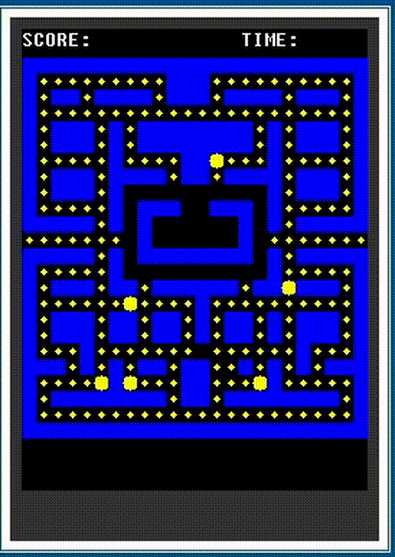

# PACMAN for LandTiger Board
# Project Overview
This project implements a Pac-Man game on the LandTiger board, which is powered by an ARM Cortex-M3 processor. It faithfully replicates the original Pac-Man mechanics while integrating specific functionalities required by the LandTiger board, including joystick controls, comprehensive game logic, AI-driven ghosts, sound effects, and CAN bus communication.

<!DOCTYPE html>
<html lang="it">
<head>
    <meta charset="UTF-8">
    <meta name="viewport" content="width=device-width, initial-scale=1.0">
    <title>GIF Grid</title>
    
</head>
<body>

    <h2>Tabella con GIF Alte e Proporzionate</h2>

    <table>
        <tr>
            <th>Game</th>
            <th>PacmanEatsGhost</th>
            <th>GhostEatsPacman</th>
            <th>Victory</th>
            <th>Game Over</th>
        </tr>
        <tr>
            <td></td>
            <td></td>
            <td></td>
            <td></td>
            <td></td>
        </tr>
    </table>

</body>
</html>

## Requirements
### First part - Basic PacMan Game

- **Labyrinth and Pills:**
  
  - Display a maze on the LandTiger screen with exactly 240 Standard Pills.
  - Maintain a central box for potential future use.
  - Generate 6 Power Pills at random positions and at random intervals.

- **Game Mechanics:**
  - Pac-Man moves continuously in the last chosen direction until it encounters a wall or receives new input.
  - The joystick allows direction changes (left, right, up, down).
  - The speed should be balanced for a smooth and enjoyable gameplay experience.
  - Teleportation: When Pac-Man reaches a teleportation point, he reappears on the opposite side of the maze.
  - Scoring system:
    
     - Standard Pills: +10 points
     - Power Pills: +50 points
     - Every 1000 points, Pac-Man earns an extra life.
  - *Pause Feature*: Pressing INT0 toggles between pausing and resuming the game.
  - *Countdown Timer*: Starts at 60 seconds; the game ends when it reaches 0.
  - *Win Condition*: Pac-Man wins by eating all the pills.
  - *Lose Condition*: The game is lost if the countdown reaches zero.
 
### Second part - Advanced Features

- **AI-Controlled Ghost (Blinky):**
  
  - *Blinky Behavior*: Actively chases Pac-Man.
  - *Movement Strategies:*
    
    - *Chase Mode:* Blinky follows Pac-Man using an AI algorithm (e.g., A* pathfinding)
    - *Frightened Mode:* Activated when Pac-Man eats a Power Pill:
      
      - Blinky turns blue for 10 seconds and runs away.
      - If Pac-Man eats Blinky, he gains +100 points.
      - Blinky respawns in the central box after 3 seconds.
- **Audio Integration:**
    - Configure the speaker to play sound effects and background music

- **CAN Bus Communication:**
  - Transmit score, remaining lives, and countdown timer via the CAN bus.
  - Configure CAN1 (sender) and CAN2 (receiver) for external loopback mode.

## Development Environment
  - Platform: LandTiger Board with ARM Cortex-M3
  - IDE: Keil µVision
  - Compilation Target: SW_Debug (for emulator) / Physical Board (for advanced features)

## How to Build and Run
  - Compile the code in Keil µVision.
  - Flash the program onto the LandTiger board.
  - Use the joystick to control Pac-Man.
  - Monitor the game status on the display and CAN bus.
  - Listen to sound effects from the speaker.

## Contributors
  - **Author:** Tommaso Centonze
## License
  - This project is licensed under the [MIT License](LICENSE).
  
